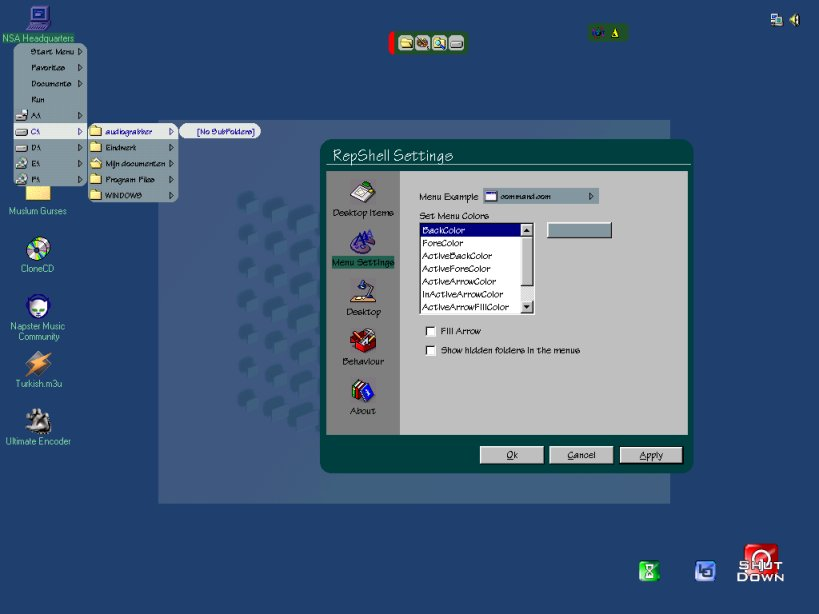



## RepShell v 0\.4

### Description

Here's RepShell v0.4 (about time or I will never

reach v 1.0). For the first time its really

usable for users with little computer knowledge.

As always the Exe is included in the zip, all

you need is the VB6 Runtime dlls. If you don't

have this, I am planning a website for RepShell

where you can also download the total setup

package. But in the meantime you can download

it from Microsoft.

RECOMMENDED SCREEN RES : I developed RepShell in

1024*768, but actually there are no screen limits.

If your screen res is to low, it looks crappy, but

so does everthing else, including explorer.

DUE TO ALL KINDS OF SMALL THINGS, NOT COMPATIBLE

WITH WINNT/2000. I'LL TRY TO FIX THIS SOON

AFTER CHANGING THE WALLPAPER FROM WINDOWS SCREEN

PROPERTIES, PRESS F5 TO REFRESH DESKTOP.

THE SPECIAL BALLOON TOOLTIP DOESN'T ALWAYS WORK

IN THE EXECUTABLE.

PLEASE RUN RunMeFirst.bat before trying to run

RepShell. This is a batch file that registers

the controls and dll used by RepShell.

LOOP HOLE IF YOU GET STUCK: PRESS CTRL + SHIFT +

Right Click the systray to start explorer.

PLEASE READ THE COMMENTS.TXT FILE TO GET STARTED

'GET STARTED: Some hotkeys and functions

RightClick My computer Icon to get a menu

Right click desktop

Key F5 to refresh desktop

Ctrl+Alt+A   : End the program

Windows key + S : Show Start Menu on mouse

position

'ONLY WORK IF REPSHELL IS DEFAULT SHELL

Windows key + F : Show Favorites menu at

mouse position

Windows key + R : Show RunDialog

'END ONLY WORK IF REPSHELL IS DEFAULT SHELL

Popupmenu button on keyboard can also be used

You can use the arrowkeys for desktop icon

navigation and menu nav

Features:  - Fully enabled taskbox with cool buttons

- In systemmenus added option "Always On Top"

to every window, which is automaticall detected

Menu is only visible from RepShell Taskbox

- Fully functional systemtray

- Right-click my computer icon to show menu

- Automatic drive recognition and listing

- Direct access to all folders

- Context menus for desktop items

- Arrow navigation on desktop and in menus

- Choose your own colors for menus

- Very fast file searching

- Ability to make RepShell default shell from the option form

- Option form to change a lot of settings

- Working desktop refreshing

- Added item to context menu of desktopitems to rename them,

this is not a standard windows function

- Simple DUN functions

- Connection info is shown in cool Balloon Tooltip

Even if you don't like the program there's a lot you can

learn from here. And I really mean a lot. It's up to you

guys to fully test it. Please leave comments.

Salihman

w/ special thanks to Zorix
 
### More Info
 

             |
---                |---
**Submitted On**   |2001-02-24 20:36:14
**By**             |[Salihman](https://github.com/Planet-Source-Code/PSCIndex/blob/master/ByAuthor/salihman.md)
**Level**          |Advanced
**User Rating**    |4.4 (22 globes from 5 users)
**Compatibility**  |VB 6\.0
**Category**       |[Complete Applications](https://github.com/Planet-Source-Code/PSCIndex/blob/master/ByCategory/complete-applications__1-27.md)
**World**          |[Visual Basic](https://github.com/Planet-Source-Code/PSCIndex/blob/master/ByWorld/visual-basic.md)
**Archive File**   |[CODE\_UPLOAD154552242001\.zip](https://github.com/Planet-Source-Code/salihman-repshell-v-0-4__1-21311/archive/master.zip)

